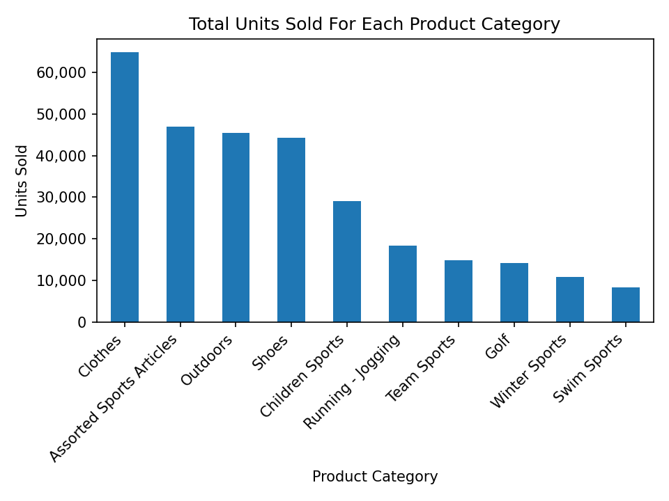
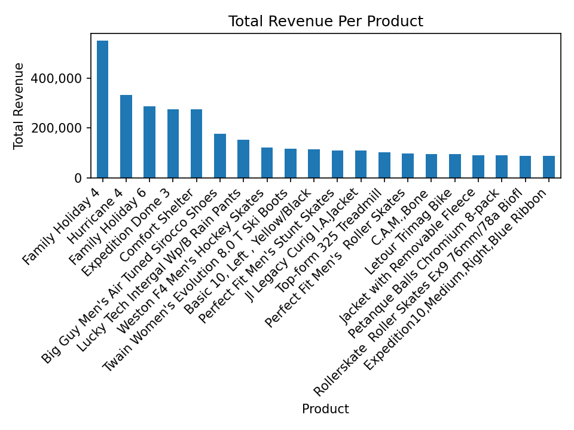
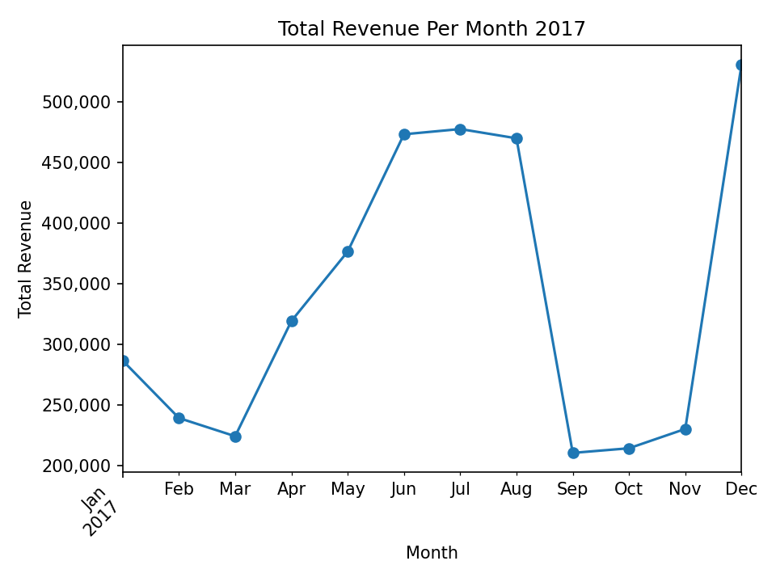
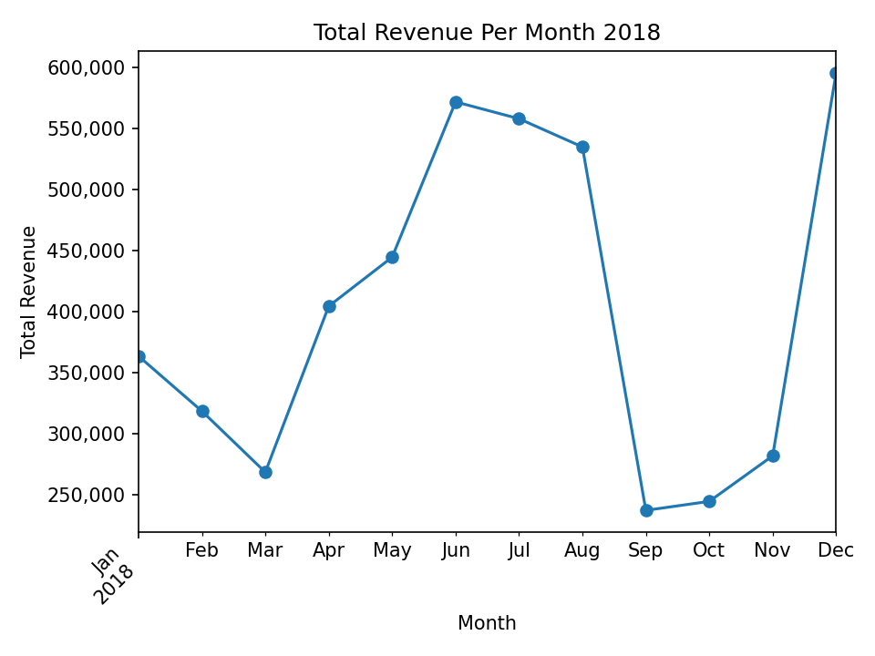
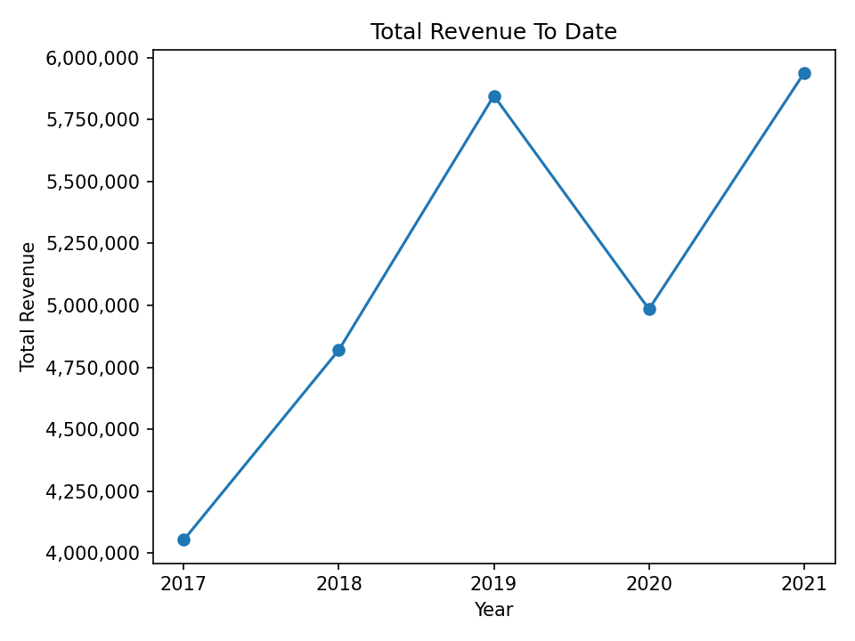
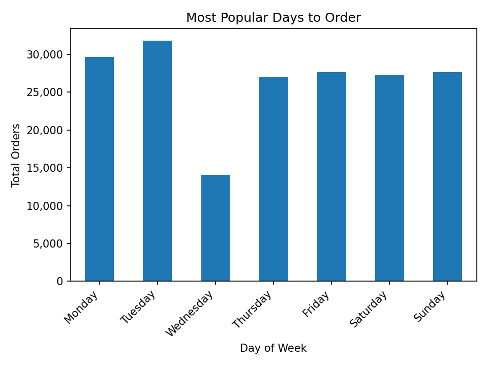
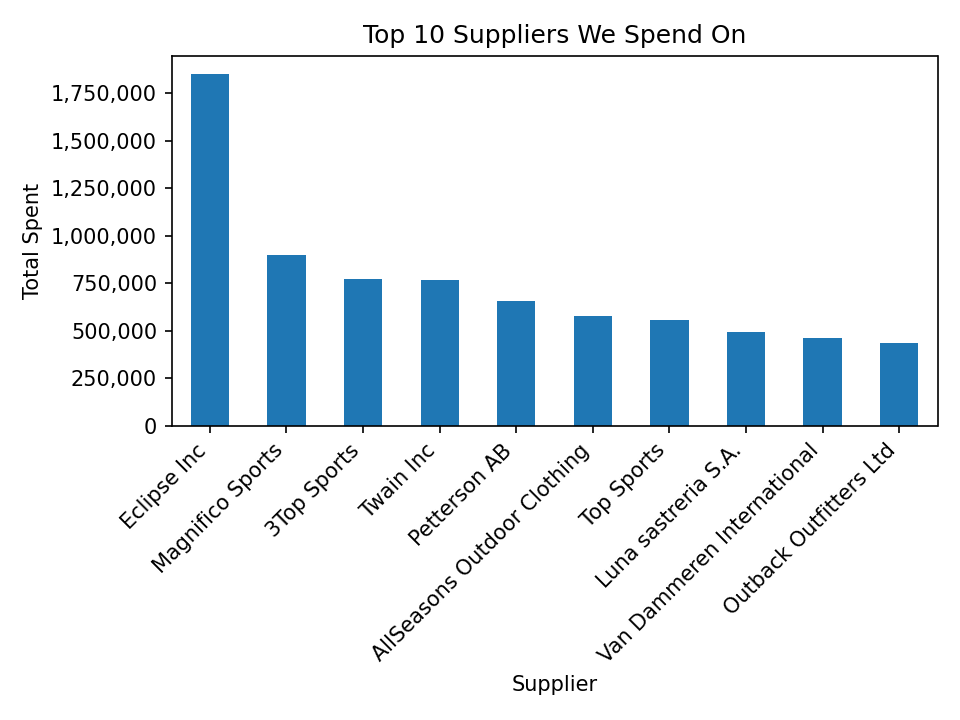
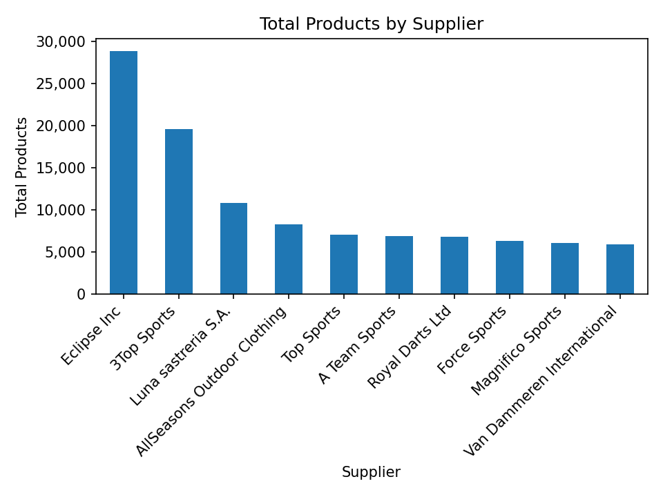

# Wholesale & Retail Sales Analysis

Python and PostgreSQL analysis of a wholesale/retail orders dataset. Data is normalized across four related tables and queried via SQL JOINs, then analyzed and visualized using pandas and matplotlib.

## Project Structure

```
PYTHON_SALES_ANALYSIS/
├── analysis.py               # main analysis script
├── connection_template.py    # database connection template (rename to connection.py)
├── charts/                   # saved chart outputs
│   ├── 01_total_units_sold.png
│   ├── 02_total_revenue_per_product.png
│   ├── 03_monthly_revenue_2017.png
│   ├── 04_monthly_revenue_2018.png
│   ├── 05_total_revenue_by_year.png
│   ├── 06_orders_by_day_of_week.png
│   ├── 07_top_suppliers_by_spend.png
│   └── 08_total_products_by_supplier.png
└── .gitignore
```

## Database Schema

Data is split across 4 normalized PostgreSQL tables to avoid redundancy:

- `customers` — customer_id, customer_status
- `suppliers` — supplier_id, supplier_name, supplier_country
- `products` — product_id, product_name, product_category, product_line, product_group, supplier_id (FK)
- `orders` — order_id, customer_id (FK), product_id (FK), order_date, delivery_date, quantity_ordered, total_retail_price, cost_price_per_unit

## Charts & Key Findings

### 1. Total Units Sold Per Product Category


Clothes dominates all other categories with over 65,000 units sold — more than 35% higher than the next closest category. Assorted Sports Articles (~47,000), Outdoors (~46,000), and Shoes (~45,000) form a close second tier. Niche categories like Swim Sports (~8,000) and Winter Sports (~11,000) trail significantly, suggesting the business is heavily weighted toward everyday apparel and general outdoor gear over specialized sports equipment.

### 2. Total Revenue Per Product


The top revenue-generating product is the Family Holiday 4 tent at over $500,000, followed by the Hurricane 4 at ~$330,000. Three tent/shelter products (Family Holiday 4, Hurricane 4, Family Holiday 6, Expedition Dome 3, Comfort Shelter) occupy the top 5 spots, all generating $260,000+. This indicates that high-ticket outdoor shelter products drive a disproportionate share of revenue despite Clothes being the top category by units — a classic volume vs. value split.

### 3. Monthly Revenue 2017


2017 shows a clear seasonal pattern. Revenue starts at ~$285,000 in January, dips to its lowest point in March (~$225,000), then climbs steadily through spring into a summer peak in June–July (~$475,000). A sharp fall off occurs in September (~$210,000) — the lowest month of the year — before recovering strongly into December (~$530,000), the single highest month. This suggests two peak seasons: summer (outdoor/sports gear) and year-end (holiday shopping).

### 4. Monthly Revenue 2018


2018 mirrors the same seasonal pattern as 2017 but at a higher scale across the board. The same March dip appears (~$268,000), summer peaks again in June (~$570,000), September drops sharply (~$238,000), and December finishes as the strongest month (~$595,000). Year-over-year the pattern is almost identical in shape, confirming this seasonality is a consistent structural feature of the business rather than a one-off anomaly.

### 5. Total Revenue By Year (2017–2021)


Revenue grew consistently from ~$4.05M in 2017 to a peak of ~$5.85M in 2019 — a 44% increase over two years. 2020 saw a notable dip to ~$4.97M, likely reflecting the impact of COVID-19 on retail purchasing. The business recovered strongly in 2021, reaching its highest recorded revenue of ~$5.92M, surpassing the pre-pandemic peak. The overall trend across the 5-year period is positive growth.

### 6. Most Popular Days to Order


Tuesday is the busiest ordering day by a clear margin at ~32,000 orders, followed by Monday (~29,500). Wednesday is a significant outlier — it drops to just ~14,000 orders, roughly half of any other day. Thursday through Sunday are all relatively consistent at ~27,000–28,000 orders each. The Wednesday drop is a notable anomaly worth investigating — it could reflect a data quality issue, a business pattern, or a genuine behavioral trend in this customer base.

### 7. Top 10 Suppliers by Spend


Eclipse Inc is by far the largest supplier by purchasing spend at ~$1.85M — more than double the second-highest supplier, Magnifico Sports (~$900,000). The top 3 (Eclipse Inc, Magnifico Sports, 3Top Sports) account for a significant portion of total purchasing budget. The remaining 7 suppliers in the top 10 cluster between $450,000–$775,000. This concentration in Eclipse Inc represents a potential supply chain risk — heavy dependency on a single supplier.

### 8. Total Products by Supplier


Eclipse Inc also leads in total product volume at ~29,000 product units, significantly ahead of 3Top Sports (~20,000) and Luna Sastreria S.A. (~11,000). The remaining suppliers sit in a tight band between ~6,000–8,000 units. Eclipse Inc's dominance in both spend and product volume confirms it as the primary supplier relationship for this business — consistent with the spend data in chart 7.

## Setup

1. Clone the repo
2. Rename `connection_template.py` to `connection.py` and fill in your PostgreSQL credentials
3. Create a PostgreSQL database and load your data into the 4 normalized tables
4. Install dependencies: `pip install pandas matplotlib psycopg2-binary`
5. Run: `python analysis.py`
6. Charts will save automatically to the `charts/` folder

## Tools Used

- Python (pandas, matplotlib, psycopg2)
- PostgreSQL
- pgAdmin 4
